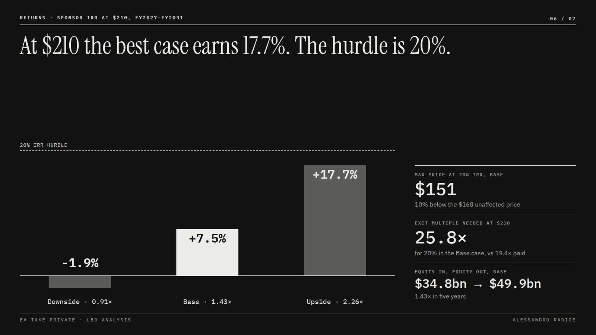
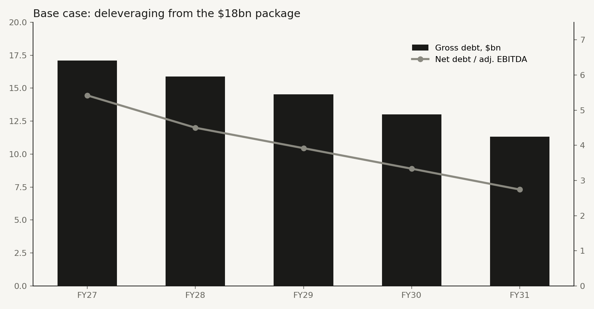

# EA Take-Private: LBO Analysis of the Largest Buyout Ever

**Author:** Alessandro Radice · M.Sc. Economics and Business Law (Finance), Università Cattolica del Sacro Cuore, Milan

**PIF, Silver Lake and Affinity Partners took Electronic Arts private at $210 per share, about $55 billion. Could a buyout fund have paid that price?**
A private equity case study on the largest leveraged buyout in history, closed on 4 August 2026. It rebuilds the deal from EA's FY2026 results and the actual $18 billion debt package: sources and uses, six debt tranches, a five-year operating plan with cost savings, a debt schedule with cash sweep, sponsor returns in three scenarios and the maximum price a fund could pay at a 20% IRR. It comes with a Colab notebook, an **Excel model with live formulas and a scenario switch**, an investment memo and a presentation deck.



---

## Objective

Every buyout starts from the same question: at this price, with this debt, does the equity earn the fund's hurdle? EA is an unusual test case, a $55bn take-private led by a sovereign wealth fund that already owned about 10% of the company.

This project has three goals:

1. **Model a real LBO end to end.** The closing debt package tranche by tranche, a bookings-based operating model, mandatory amortisation and a cash sweep, exit and returns.
2. **Measure the ability to pay.** The highest price per share a sponsor could pay at a 20% IRR, and the exit multiple it would need at $210.
3. **Deliver it in deal-team format.** An auditable Excel model with a scenario switch, reconciled with the Python engine, plus a memo and a deck.

---

## Key results

| | Downside | Base | Upside |
|---|---|---|---|
| Net bookings growth / cost savings / exit multiple | 2% / $200m / 14× | 5% / $400m / 16× | 8% / $700m / 19× |
| FY2031 adj. EBITDA | $3.11bn | $3.76bn | $4.57bn |
| Net debt / EBITDA, close → FY2031 | 6.4× → 3.9× | 6.4× → 2.7× | 6.4× → 1.8× |
| **Sponsor IRR / MoM at $210** | **–1.9% / 0.91×** | **7.5% / 1.43×** | **17.7% / 2.26×** |
| **Maximum price at a 20% IRR** | **$122** | **$151** | **$197** |
| Exit multiple needed for 20% at $210 | 31.7× | 25.8× | 20.7× |

- **Entry:** $54.8bn of uses and an entry enterprise value of $51.2bn, 19.4× FY2026 adjusted EBITDA, funded with $34.8bn of equity (63.5%), $18.0bn of new debt (6.8×) and $2.0bn of EA's cash.
- **Credit:** the business carries the debt comfortably: the Base case repays $6.7bn and cover rises from 2.4× to 4.0×.
- **Conclusion:** no scenario reaches a 20% IRR at $210. In the Base case a 20%-IRR buyer could pay $151, below the $168 unaffected price. The price fits a long-term owner with a lower cost of capital, and PIF funds most of the equity.



---

## What it does

| Step | Module | What it produces |
|---|---|---|
| 1 | **Data** | FY2025–FY2026 financials from the earnings release and 10-K, share count, deal terms, closing debt package |
| 2 | **Sources & uses** | Equity purchase, refinancing of the old notes, fees and OID vs new debt, balance-sheet cash and sponsor equity |
| 3 | **Operating model** | Net bookings, adjusted EBITDA with cost savings, cash compensation replacing stock awards, capex, cash taxes |
| 4 | **Debt schedule** | TLA, USD and EUR term loan B, USD and EUR secured notes, unsecured notes: interest, amortisation, cash sweep |
| 5 | **Returns** | Exit value, sponsor IRR and MoM by scenario |
| 6 | **Ability to pay** | Maximum price per share at the target IRR; exit multiple needed at the offer price |
| 7 | **Sensitivity** | IRR by entry price and exit multiple |
| 8 | **Exports** | Excel model with live formulas and a scenario switch, and a chart |

### The Excel model (7 tabs)
`Cover` · `Inputs` · `Sources & Uses` · `Operating Model` · `Debt Schedule` · `Returns` · `Sensitivity`

- **Scenario switch:** one cell on `Inputs` (1 = Downside, 2 = Base, 3 = Upside) drives the whole model.
- Banker colour code: **blue** = hard-coded input, **black** = formula, **green** = link to another sheet.
- 353 formulas, a sources = uses check, and every output reconciled with the Python engine in all three scenarios.

---

## Methodology

- **Adjusted EBITDA** on a net bookings basis: operating income + change in deferred net revenue + D&A + stock-based compensation ($2,636m in FY2026). $18.0bn / $2,636m = 6.8×, the gross leverage reported for the financing.
- **Operating case:** bookings growth by scenario, a constant 32.8% margin on bookings plus cost savings (half in FY2027), 50% of former stock-based pay moved to cash, capex and D&A at FY2026 ratios, cash taxes at 21%.
- **Debt:** interest on opening balances, so there is no circularity. Mandatory amortisation first (5% TLA, 1% term loan B), then 100% of cash above a $1.0bn minimum sweeps the TLA and the term loan Bs; the notes are bullets.
- **Returns:** five full fiscal years (FY2027–FY2031) after the August 2026 close, exit at an EV/EBITDA multiple, sponsor equity treated as one cheque including PIF's rollover at $210.
- **Ability to pay:** because the debt package is fixed at $18bn, the entry price changes only the equity cheque, so the maximum price and the sensitivity grid are exact closed-form results.

## Limitations

- The TLA spread and amortisation, SOFR (3.75%), Euribor (2.25%), fees, minimum cash and the share of stock-based pay moved to cash are assumptions.
- Annual model over five full fiscal years; measured from the August 2026 close (about 4.7 years), the Base IRR would be about 8% instead of 7.5%. Euro tranches are held at the exchange rate implied at signing.
- Taxes ignore the US limit on interest deductibility, which is material here: FY2027 interest exceeds 30% of tax EBITDA.
- Only half of former stock-based pay is charged as a cash cost; the other half is neither a cash cost nor dilution at exit, which flatters returns.
- No dividend recap, IPO or strategic exit is modelled, and the strategic value to PIF is outside the model.

This project is for educational purposes and is not investment advice.

---

## What you need

| Requirement | Details |
|---|---|
| **Environment** | A Google account to run the notebook in [Google Colab](https://colab.research.google.com), free tier is enough. It also runs in any local Jupyter with Python 3.10+. |
| **Python libraries** | `pandas`, `numpy`, `matplotlib`, `xlsxwriter`. The first cell installs what is missing. |
| **To open the outputs** | Microsoft Excel or Google Sheets; any PDF reader. |
| **Background knowledge** | LBO mechanics, debt tranches and cash sweeps, IRR and MoM. |

## How to run it

1. Open `EA_LBO_Analysis.ipynb` in Google Colab.
2. Change the assumptions in the **Configuration** and **Data** cells if you want: scenario drivers, base rates, fees, target IRR.
3. `Runtime → Run all`. The Excel model and the chart download automatically.
4. In Excel, set `Inputs!C5` to 1, 2 or 3 to switch scenario, or edit any blue cell.

---

## Repository structure

```
├── EA_LBO_Analysis.ipynb     # the notebook (run this)
├── ea_lbo.py                 # same code as a plain Python script
├── EA_LBO_Model.xlsx         # Excel model with live formulas and a scenario switch
├── EA_LBO_Memo.pdf           # investment memo
├── EA_LBO_Deck.pdf           # seven-slide presentation
├── returns.png               # slide used in this README
├── deleveraging.png          # chart used in this README
└── README.md
```

## Sources

- Electronic Arts, [Q4 and FY2026 earnings release](https://www.sec.gov/Archives/edgar/data/712515/000071251526000053/earningspressrelease2026_0.htm) and 10-K, SEC EDGAR (May 2026)
- [Electronic Arts closing 8-K](https://www.stocktitan.net/sec-filings/EA/8-k-electronic-arts-inc-reports-material-event-e0a3b9a73495.html), via Stock Titan (August 2026)
- [EA bonds land tight of price talk](https://octus.com/resources/articles/electronic-arts-bonds-land-tight-of-price-talk-in-highly-anticipated-jpmorgan-led-syndication-lbo-debt-financing-gathers-45b-in-demand-from-investors/), Octus (March 2026)
- [Electronic Arts launches leveraged loan](https://pitchbook.com/news/articles/electronic-arts-launches-leveraged-loan-backing-largest-lbo-debt-deal-since-financial-crisis), PitchBook (March 2026)
- [Leveraged buyout of Electronic Arts](https://en.wikipedia.org/wiki/Leveraged_buyout_of_Electronic_Arts), Wikipedia
- [PIF, Silver Lake and Affinity's $55bn acquisition of EA](https://www.mergersight.com/post/affinity-partners-pif-and-silver-lake-s-55bn-acquisition-of-electronic-arts), MergerSight

## Tools

`Python` · `pandas` · `numpy` · `matplotlib` · `xlsxwriter` · Google Colab · Excel
